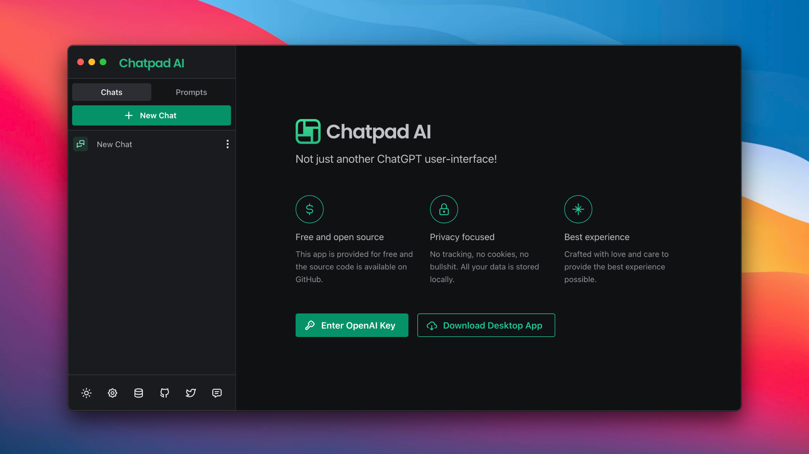

<h1 align="center">Chaty</h1>
<h2 align="center">A better Chatpad clone!</h2>

<a href="https://chaty.uk">Web App</a>

### ✨ GPT4 Turbo Ready

Access the cheaper but stronger GTP4-Turbo through API

## Installation

This is a React.js application. Clone the project, run `npm i` and `npm start` and you're good to go.
